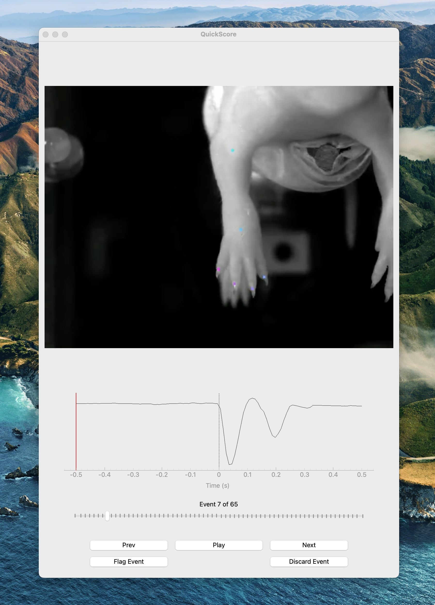

# QuickScore
Lightning-fast behavioral scoring tool.



## About
Scoring behavior is time-consuming. Verifying pre-identified behavior is much faster.

This application takes 1) video, 2) event timestamps, and 3) a timeseries. The video is then clipped into 1-s 
segments for faster scoring.

This application took my behavioral scoring from several hours to ~20 minutes per subject.

**Hotkeys are paramount here**. Go slow until they are second nature.

## Installation

1. Clone the repo
2. (Recommended) Create a virtual environment

   `python -m venv .venv`

3. Install dependencies
    
    `pip install -r requirements.txt`

## Use

(If you installed the dependencies in a virtual environment):

   ```
   source .venv/bin/activate  # macOS
   
   . .\.venv\Scripts\activate  # Windows
   ```

Launch the app:
    
    `python startup.py`

Open the files:

1. Click `1` to open a video file
2. Click `2` to open an events file (single-column CSV, no header row)
3. Click `3` to open a timeseries file (single-column CSV, no header row)

### Adjust an event
Simply move the center line in the timeseries graph to adjust the timing of the current event.

### Create a new event
If you see an event that is not in your original CSV, but you want to add it to the data, hold down `Alt` and move 
the center line on the TimeSeries graph to the desired position.

### Label an event
Click `Shift` to open the label editor. Use `tab` to toggle left/right, and type the label. The autosuggestions can 
be changed [here](app/views/label_view.py#L49). Click `Enter` to save the label.

### Save Results
Saving is performed automatically with every operation.

### Hotkeys

```
# Files
1: Open Video
2: Open Events
3: Open Timeseries

# Playback
Left Arrow: Previous Event
Right Arrow: Next Event
Right Mouse Click: Next Event
Space: Replay current event
Alt: Hold and drag the center line to create a new event

# Playback Speed
Comma: 1x Speed
Period: 0.5x Speed
Slash: 0.25x Speed

# Events
F: Flag event
D: Discard event

# Labels
Shift: Open label editor
Tab: Toggle L/R prefix
Enter: Save label and close editor
```

## License
QuickScore is distributed under the MIT License.